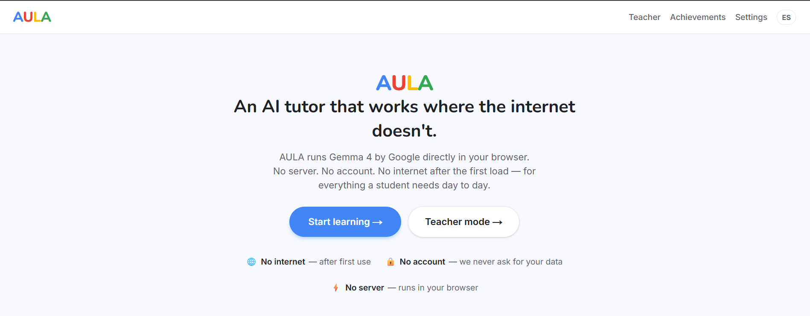
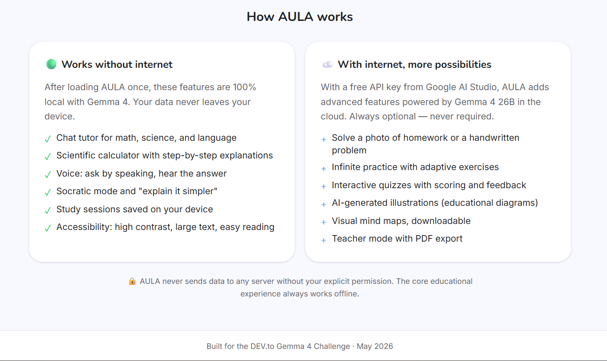
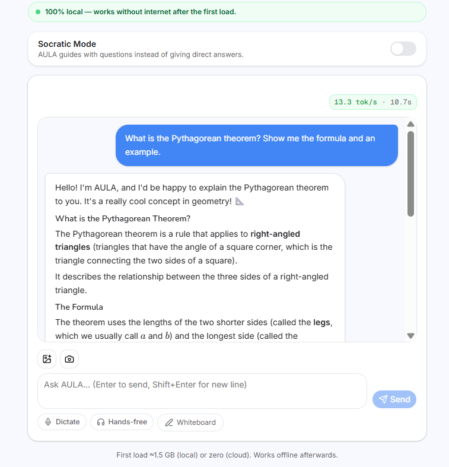
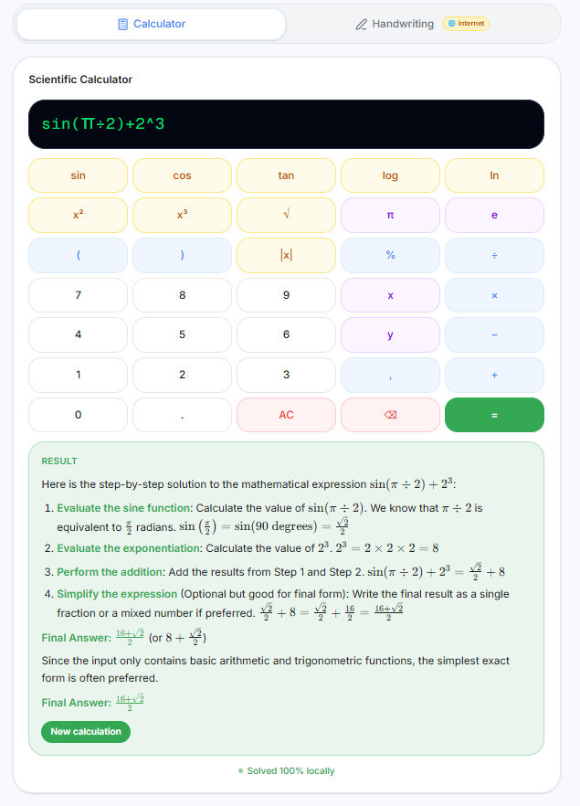
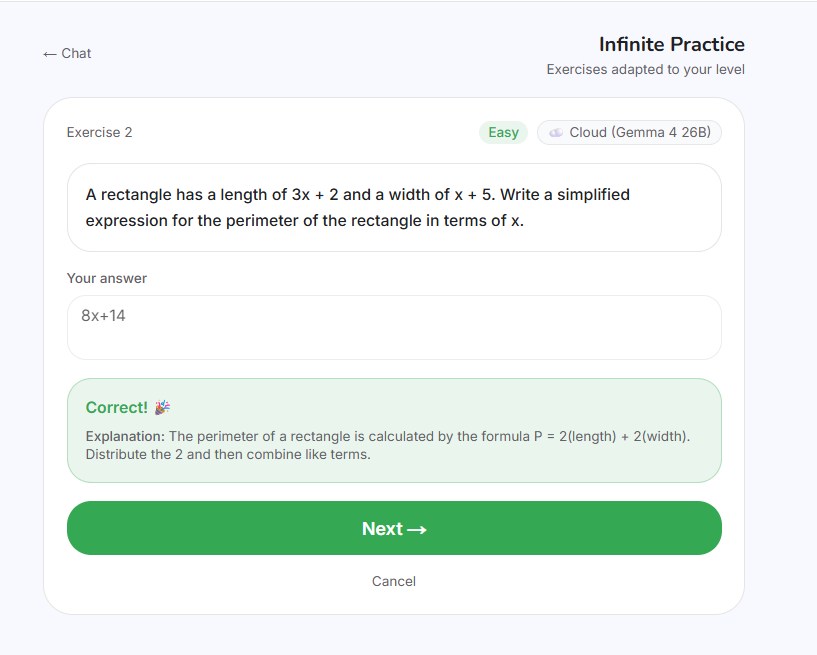
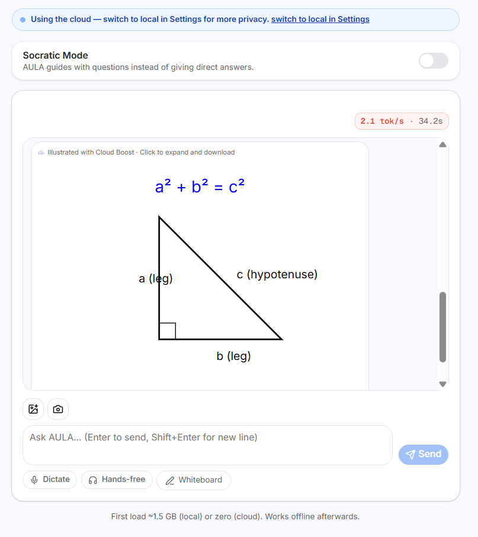
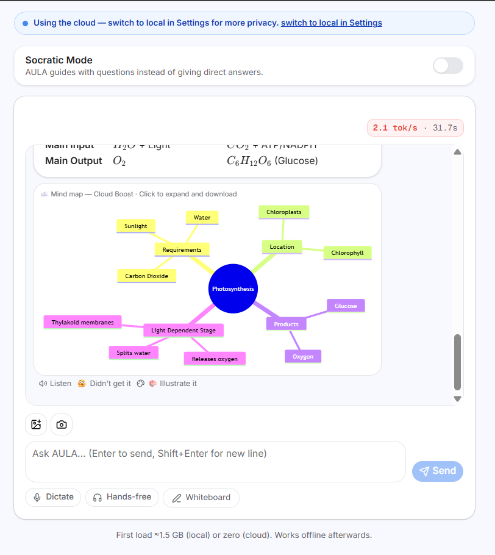
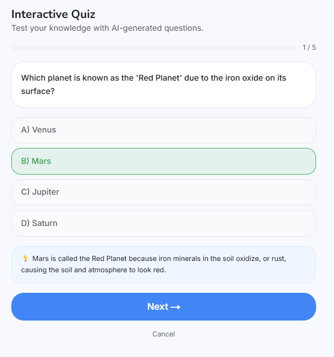
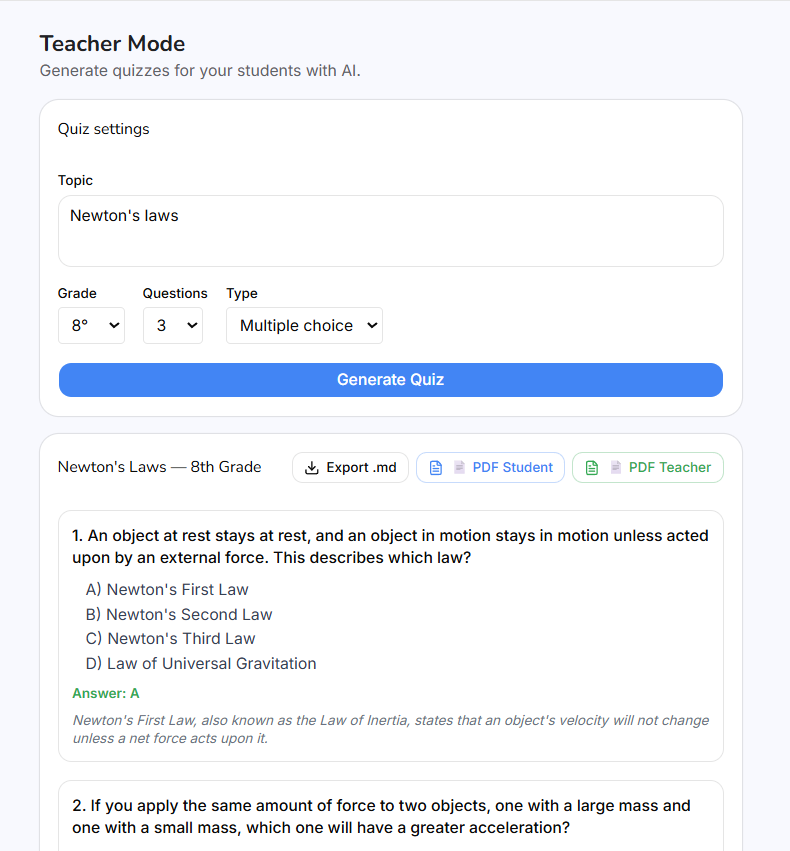
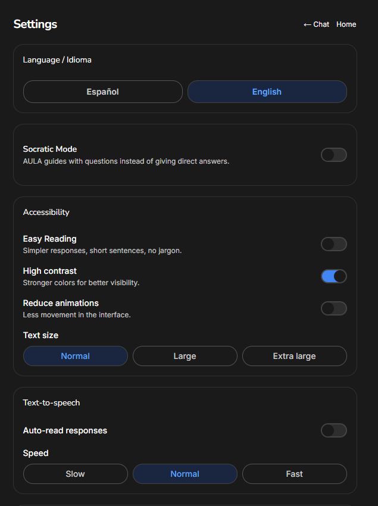

<div align="center">

# AULA

### Offline-first AI tutoring, powered by Gemma 4.

**A complete educational platform that runs entirely in the browser.  
Built for the 400 million Latin American students for whom unreliable  
internet is not an inconvenience — it is the default.**

[](https://ai.google.dev/gemma)
[](https://nextjs.org)
[](https://www.w3.org/TR/webgpu/)
[](./LICENSE)
[](https://dev.to/challenges/gemma)

[**Video walkthrough**](https://youtu.be/d0jN8Kw_Cz4) · [**Architecture**](#architecture) · [**Why this matters**](#the-problem)

</div>

<br/>

<p align="center">
  
</p>

---

## The problem

In Latin America, **40% of students** live in areas with unreliable, capped, or non-existent internet connectivity. UNESCO and CEPAL estimates put the figure at over 65 million children for whom every megabyte counts, and another 80 million whose access depends on a parent's phone or a school's intermittent WiFi.

For these students, the AI revolution simply does not exist. ChatGPT requires a stable connection. Gemini requires an account, latency, and bandwidth. Khan Academy's AI tutor requires a server roundtrip per message. The very tools that could close the global education gap **are inaccessible exactly where they are needed most**.

The premise of AULA is straightforward: **if Google's Gemma 4 can run on a Raspberry Pi 5, it can run on a teacher's laptop in rural Boyacá.** The browser is the most universal application platform in the world. With WebGPU and MediaPipe, we now have the runtime to make this happen.

This project is what that looks like as a finished product.

---

## What AULA is

AULA is a **dual-engine educational platform** that runs Gemma 4 in two complementary modes:

| Mode | Model | Runtime | When used |
|---|---|---|---|
| **Local** | Gemma 4 E2B (q4f16, ~1.5 GB) | Browser via MediaPipe + WebGPU | All core educational features. Default. |
| **Cloud Boost** | Gemma 4 26B-A4B (mixture-of-experts) | Gemini API | Structured-output features (JSON quizzes, SVG, Mermaid). Opt-in. |

The local engine handles 80% of student interactions. The cloud engine is **never required** — every student gets a fully functional tutor without ever touching the internet again after the initial 1.5 GB download. For schools, that download can be done once on a teacher's connection and propagated via USB.

After the first load:

- **No server roundtrips** for chat, voice, calculation, sessions
- **No account, no telemetry, no tracking**
- **No subscription, no API key, no cost** for the local features
- **Works in airplane mode, with WiFi off, in a building with no signal**

<p align="center">
  
</p>

---

## Architecture

```
                  Browser (Chrome / Edge with WebGPU)
       ┌──────────────────────────────────────────────────┐
       │                                                  │
       │   ┌────────────────┐         ┌────────────────┐  │
       │   │  React 19      │         │  Service       │  │
       │   │  Next.js 16    │ ◄─────► │  Worker (PWA)  │  │
       │   │  App Router    │         │  + Cache API   │  │
       │   └────────┬───────┘         └────────────────┘  │
       │            │                                     │
       │   ┌────────▼────────────────────────────────┐    │
       │   │      Engine Routing Layer               │    │
       │   │      (Zustand store + decision logic)   │    │
       │   └──┬──────────────────────────────────┬───┘    │
       │      │                                  │        │
       │      ▼                                  ▼        │
       │  ┌─────────────────────┐    ┌──────────────────┐ │
       │  │  LocalEngine        │    │  CloudBoostEngine│ │
       │  │  MediaPipe          │    │  fetch + SSE     │ │
       │  │  LlmInference       │    │  parser          │ │
       │  │  WebGPU delegate    │    │                  │ │
       │  │  Gemma 4 E2B .task  │    │                  │ │
       │  └─────────────────────┘    └──────────────────┘ │
       │                                       │          │
       └───────────────────────────────────────┼──────────┘
                                               │
                                               ▼
                              ┌─────────────────────────────┐
                              │  Google AI Studio           │
                              │  generativelanguage.        │
                              │  googleapis.com             │
                              │  Gemma 4 26B-A4B-IT         │
                              └─────────────────────────────┘
```

**Why this architecture?**

Gemma 4 E2B has ~2 billion effective parameters. It is extraordinary at conversational reasoning, math explanation, language tasks, and pedagogical adaptation. It is not reliable at strict structured-output generation (perfect JSON without prose, syntactically-valid Mermaid, complete SVG with coherent geometry) — this is a known limitation of small open models, not a bug in our implementation.

Rather than fight this limitation or hide it, AULA's architecture makes the tradeoff explicit and visible to the user. Every screen tells you which engine answered. Local: green badge. Cloud: blue badge. Always.

---

## Features

### 100% offline (Gemma 4 E2B locally)

<table>
<tr>
<td width="50%">

**🎓 Conversational tutor**  
Chat with Gemma 4 in natural language, with full LaTeX rendering for math and science. Streams at ~15 tokens/sec on a mid-range laptop GPU (NVIDIA RTX 3050), ~25 tok/s on M-series Apple Silicon.

**🧮 Scientific calculator**  
Visual keypad with trigonometric functions, exponents, roots, and variables. Builds expressions step by step. Gemma 4 explains the solution pedagogically, not just numerically.

**🎙️ Voice tutoring (bidirectional)**  
Web Speech API for STT and TTS. Ask by speaking, listen to the response. Optional Hands-Free Mode chains them together for situations where the student is doing manual work.

**🦉 Socratic mode**  
A toggle that changes the system prompt: Gemma 4 stops giving answers and only asks guiding questions until the student arrives at the conclusion. Pedagogically rigorous, never bypasses thinking.

</td>
<td width="50%">

**🤔 "Explain it simpler"**  
Three escalating levels of reformulation on demand. Each level uses a different prompt strategy: vocabulary substitution, then concrete examples, then analogies from daily life.

**💡 Conceptual error detection**  
When a student answers incorrectly, Gemma 4 diagnoses which concept was misunderstood — not just "wrong, try again". Powered by a dedicated diagnostic prompt.

**📚 Persistent study sessions**  
IndexedDB stores complete conversation history, organized by subject and date. The student builds a personal study record without any cloud sync.

**♿ Accessibility-first**  
High contrast, three text sizes, reduced-motion respect, Easy Reading Mode (short sentences, simple vocabulary, generous spacing), auto-read responses, configurable speech rate.

**🌍 Bilingual ES ↔ EN**  
Full i18n. Both UI and model responses adapt — the system prompt is translated, not just labels.

**🏆 Local gamification**  
XP, levels (Apprentice → Explorer → Erudite), daily streak, unlockable achievements. All in IndexedDB.

</td>
</tr>
</table>

### Cloud-enhanced (Gemma 4 26B-A4B, opt-in)

<table>
<tr>
<td width="50%">

**✍️ Handwritten whiteboard**  
Draw equations with finger, stylus, or mouse. Gemma 4 reads the strokes and solves. Renders KaTeX-formatted solutions inline.

**📷 Photo OCR + reasoning**  
Point camera at a printed exercise or upload a photo. Local OCR via tesseract.js extracts text; Gemma 4 solves. Cloud fallback for handwritten or complex images.

**♾️ Infinite adaptive practice**  
Generates a never-repeating sequence of exercises per topic. Difficulty adjusts dynamically: three correct in a row pushes up, two wrong pulls back. Internal seen-questions buffer prevents variation collapse.

</td>
<td width="50%">

**🎯 Interactive student quiz**  
Configurable self-assessment (3/5/10 questions, easy/medium/hard, by topic). Multiple choice with scoring, per-error review with the conceptual diagnostic engine.

**👩‍🏫 Teacher mode with PDF export**  
Generate full quizzes by topic and grade level. Two PDF outputs: student version (no answers, with answer lines) and teacher version (with correct answers and explanations).

**🎨 SVG illustrations**  
"Illustrate this" button on any response. Gemma 4 generates educational diagrams (Pythagoras, water cycle, photosynthesis, cells). Click to enlarge, download as SVG or PNG.

**🗺️ Mermaid mind maps**  
"Mind map" button generates interactive concept diagrams in Mermaid syntax, rendered live. Same lightbox + download flow as illustrations.

</td>
</tr>
</table>

> **Privacy guarantee:** AULA never sends any data to any third party without an explicit API key configured by the user. The local features never make a network request after the initial model download. The Cloud Boost endpoint is the user's own Google AI Studio API key — Google sees the request, AULA's developers never do.

---

## Showcase

<table>
<tr>
<td width="50%">
  <strong>Chat tutor (100% local)</strong><br/>
  <br/>
  <em>Full LaTeX rendering. ~15 tokens/sec on consumer hardware. Zero network requests during inference.</em>
</td>
<td width="50%">
  <strong>Scientific calculator (100% local)</strong><br/>
  <br/>
  <em>Visual keypad → Gemma 4 explains the solution pedagogically.</em>
</td>
</tr>
<tr>
<td width="50%">
  <strong>Adaptive practice (Cloud)</strong><br/>
  <br/>
  <em>Never-repeating exercises. Difficulty adapts to student performance.</em>
</td>
<td width="50%">
  <strong>Pythagoras illustration (Cloud)</strong><br/>
  <br/>
  <em>Gemma 4 generates valid SVG with geometry, labels, and color semantics.</em>
</td>
</tr>
<tr>
<td width="50%">
  <strong>Mermaid mind map (Cloud)</strong><br/>
  <br/>
  <em>From a concept to an interactive diagram in one click. Downloadable as SVG/PNG.</em>
</td>
<td width="50%">
  <strong>Interactive student quiz</strong><br/>
  <br/>
  <em>Self-assessment with per-error conceptual review.</em>
</td>
</tr>
<tr>
<td width="50%">
  <strong>Teacher mode with PDF export</strong><br/>
  <br/>
  <em>Generate quizzes by grade and topic. Export student/teacher PDFs offline.</em>
</td>
<td width="50%">
  <strong>High contrast accessibility</strong><br/>
  <br/>
  <em>Built-in accessibility: contrast, text size, easy reading, auto-TTS.</em>
</td>
</tr>
</table>

---

## Tech stack

**Frontend**

- Next.js 16 (App Router, React 19, Server Components where applicable)
- TypeScript in strict mode, zero `any`
- Tailwind CSS v4 with custom AULA design tokens
- lucide-react for iconography
- KaTeX for math typesetting in responses
- Mermaid for diagram rendering with sandboxed security

**AI runtime**

- `@mediapipe/tasks-genai` with WebGPU delegate for local inference
- Gemma 4 E2B-IT as `.task` artifact (~1.5 GB quantized to q4f16)
- Gemini API (REST + SSE for streaming) for Cloud Boost
- Gemma 4 26B-A4B-IT as the cloud model (mixture-of-experts, lower latency than 31B-IT at comparable quality)

**State and storage**

- Zustand with localStorage persistence for app state
- `idb` wrapper for IndexedDB (study sessions, gamification, accessibility prefs)

**Auxiliary**

- jsPDF for client-side PDF generation (teacher mode)
- tesseract.js for local OCR fallback
- Web Speech API for STT and TTS (no third-party voice cloud)
- Custom i18n (React Context + JSON resources, no next-intl to keep bundle minimal)

**Build and deploy**

- pnpm as package manager
- Vercel for static hosting (the model runs on the client; the server only serves the JS bundle)

---

## Hardware footprint

Tested on the following configurations:

| Hardware | RAM | GPU | Local tok/s | First-load time |
|---|---|---|---|---|
| Raspberry Pi 5 (8 GB) | 8 GB | iGPU (Mali) | ~7 (CPU fallback) | ~3 min |
| Pixel 8 Pro | 12 GB | Tensor G3 | ~5 | ~2 min |
| MacBook M3 | 16 GB | M3 GPU | 20–25 | ~30 sec |
| Windows laptop, RTX 3050 (6 GB) | 32 GB | NVIDIA Ampere | 14–16 | ~45 sec |

The minimum supported configuration is any device that runs Chrome 113+ with WebGPU enabled. On devices without WebGPU, the app gracefully degrades to Cloud Boost mode (requires API key) or to CPU inference (slow but functional).

---

## Getting started

```bash
# Clone
git clone https://github.com/jpablortiz96/aula
cd aula

# Install
pnpm install

# Run
pnpm dev   # serves on http://localhost:3100
```

On first visit:

1. Open [http://localhost:3100/chat](http://localhost:3100/chat)
2. Click **Start AULA** to download Gemma 4 E2B (~1.5 GB, one-time)
3. After download, the app works fully offline

To enable Cloud Boost features (whiteboard handwriting, illustrations, mind maps, infinite practice, quizzes):

1. Get a free API key at [https://aistudio.google.com/apikey](https://aistudio.google.com/apikey)
2. Open **Settings** → paste the key → **Save**

That's it. There is no signup, no other dependency.

---

## Project structure

```
src/
├── app/                          # Next.js App Router routes
│   ├── page.tsx                  # Landing
│   ├── chat/                     # Main tutor
│   ├── pizarra/                  # Calculator + handwriting
│   ├── practice/                 # Infinite practice
│   ├── quiz/                     # Interactive student quiz
│   ├── teacher/                  # Teacher mode + PDF
│   └── settings/                 # Engine, API key, accessibility, i18n
├── components/
│   ├── pizarra/                  # ScientificCalculator, DigitalWhiteboard
│   ├── practice/                 # InfinitePractice
│   ├── quiz/                     # InteractiveQuiz
│   ├── mermaid/                  # MermaidRenderer with sandboxing
│   └── ui/                       # SvgLightbox, AccessibilityProvider, design system
├── lib/
│   ├── cloudNoStream.ts          # Cloud non-streaming helper for structured output
│   ├── jsonExtract.ts            # Tolerant JSON extractor for small-model output
│   └── practice/                 # Exercise generation + answer matching
├── store/
│   ├── engineStore.ts            # Engine selection + API key
│   ├── i18nStore.ts              # Language preference
│   └── progressStore.ts          # XP, level, streak, achievements
├── hooks/
│   ├── useT.ts                   # i18n translation hook
│   ├── useSpeechRecognition.ts   # STT wrapper
│   └── useSpeechSynthesis.ts     # TTS wrapper
└── i18n/                         # ES + EN resource files
```

---

## What was hard, and what we learned

AULA was built for the DEV.to Gemma 4 Challenge. Some technical learnings worth sharing:

**transformers.js + WebGPU is not yet production-grade on NVIDIA Optimus laptops.** Initial attempts produced only 2 tokens/sec on an RTX 3050 due to dispatch routing through the iGPU. Migrating to MediaPipe with the WebGPU delegate jumped throughput to 14–16 tokens/sec — a 7× improvement on the same hardware. MediaPipe is Google's official runtime for Gemma 4 on edge.

**Small models cannot be forced into rigid structured output.** Gemma 4 E2B is brilliant at conversation but unreliable at "respond only with valid JSON" or "respond only with a coherent SVG". The learning was to route structured-output features to the cloud and design the UI to make the routing transparent. Honesty beat ideology.

**Concurrency on LlmInference is exclusive.** A single MediaPipe LlmInference instance can process one prompt at a time. When two routes tried to use the same singleton concurrently, the model locked. A FIFO queue with abort propagation across navigations solved this.

**WebGPU is the unblocker.** Browser-native inference at this quality was simply impossible 18 months ago. This is the first moment where deploying a 2B-parameter multimodal model in a tab is genuinely production-grade.

**PDF generation is mature and offline-friendly.** jsPDF produces classroom-ready handouts entirely client-side. The teacher mode PDF export was the simplest feature to build and one of the highest-utility for the actual rural teachers AULA aims to reach.

---

## Roadmap

See [IDEAS_FUTURAS.md](IDEAS_FUTURAS.md) for the full v1.1, v1.2, v2.0, and v3.0 plan.

The most immediate next items:

- PWA installation prompt with offline manifest and pre-cached model artifacts
- USB-deployable bundle for schools to install AULA on multiple laptops without re-downloading the model on each
- Local audio input via Gemma 3n as an optional module (the only Gemma variant currently supporting in-browser audio)
- Curriculum packs aligned to Colombian Ministry of Education standards, then expanded regionally

---

## Acknowledgments

- Google for releasing Gemma 4 under terms that make this kind of project possible
- The MediaPipe Web team for the WebGPU delegate
- The DEV.to community for the platform and the challenge

Gemma is a trademark of Google LLC. AULA is an independent open-source project, not affiliated with or endorsed by Google.

---

## License

MIT — see [LICENSE](LICENSE). Use it, fork it, deploy it in any school.

---

<div align="center">

AULA is made with care for students everywhere.  
🇨🇴 From Colombia, for the world.

If this project resonates with you, please give it a ⭐ and share it with a teacher who needs it.

</div>
